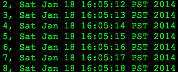

Bash One Liner
==============

Simple streamed timestamped sensor data from your Arduino.


This method accomplishes fast-fast timestamped data without purchasing an RTC.

This can also be done via a bluetooth tty port (in theory, I haven't tried).

**(there was a lot of work put into this, to me it's like a haiku)


## How to use it

This is basically what we've always wanted: serial monitor straight to stdout of shell.

You can also get the timestamp in nanoseconds (if you use a Linux machine, Raspberry Pi anyone?).

**Furthermore, it is one line:**

```bash
cat /dev/cu.usbmodem1421 | awk '{ for (i=0; i<NF; i++) printf $i + system("date +,%s")}'
```


**... and can redirect easily into a data file**
```bash
cat /dev/cu.usbmodem1421 | awk '{ for (i=0; i<NF; i++) printf $i + system("date +,%s")}' >> sensor_readings.dat
```


**... and it can be used to allow the arduino to control the command line:**
```bash
cat /dev/cu.usbmodem1421 | awk '{ for (i=0; i<NF; i++) if($i == 9001) {system("say ITS OVER 9000\!")} printf $i + system("date +,%s")}' >> sensor_readings.dat
```


### Sample Output



