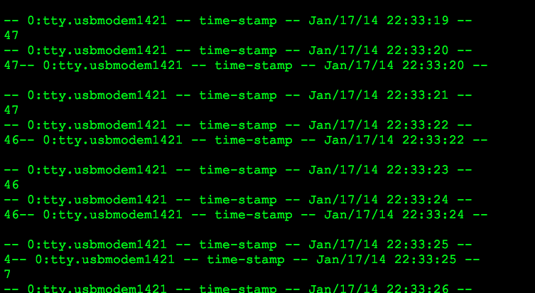

GNU-Screen
==========


This is a simple method which doesn't even require python.


## Two Simple Steps


**First**, add the following to your `~/.screenrc` file using your favorite text editor (I use `vim`):

```bash
logtstamp on
logtstamp after 0.5
logfile flush 0.5
logfile "screenlog.%t.%1`"
log on
```

And 2) type in the following:


`screen -L /dev/tty.usbmodem9999`  instead of /dev/tty.usbmodem9999, use the serial port it says on the bottom right corner of the Arduino ide.

You are getting timestamps -- but there is one thing you will need to do:

notice this output below:



The data is not inline with the timestamp.

Verdict
-------

While this method is terse, until the data can be reliably placed inline with the timestamp (or at some script which places them in standard csv, json, or tsv format) then it may be better to poll with py-serial.

Checkout the py-serial implementation to learn more.


